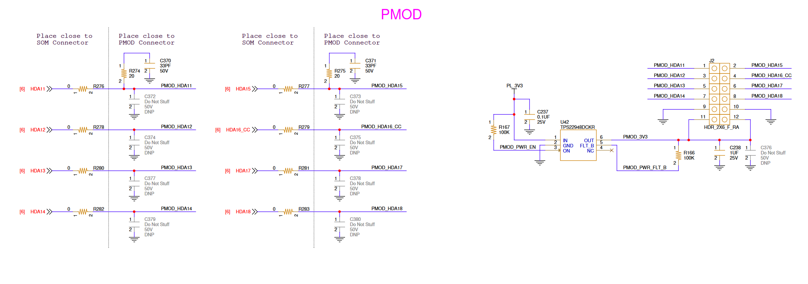

# Design Notebook
- [Design Notebook](#design-notebook)
  - [Introduction](#introduction)
  - [Getting Started](#getting-started)
  - [Kria KV260](#kria-kv260)
  - [A Peek into Manual Pin Mapping](#a-peek-into-manual-pin-mapping)
  - [Starting a Vivado Project](#starting-a-vivado-project)
  - [Working on the project in Vitis](#working-on-the-project-in-vitis)
## Introduction
This project was created for the Computer Engineering Senior Capstone project at Clarkson University.   
The idea is to implement a hardware-based keylogger that will check the inputted text against a database of prerecorded typing from the user to authorize access to the computer. Currently, this is implemented for a Fixed Text approach which means a arbitrary word is typed over and over for training and then tested on the same word once. If the user types the word in the same exact manner as the training, then the system shall authorize them access to the computer. Instead of fixed text, a free text approach can also be utilized. Free text would constantly compare the users keyboard input to their previous authorized inputs using a Deep Learning model.    
This project was initially implemented as a web browser extension, but to enhance security, a hardware-based keylogger was developed- plus it's a great learning experience.    

The following **hardware** was chosen:
```
Xilinx Kria KV260 AI Vision Starter Kit -> MPSoC (Contains an FPGA and MPU)
Digilent PMOD Buttons
Ethernet cable -> For LAN Access to the board
USB Keyboard 
```
With the following **software** stack:
```
Windows 10 -> For installing Ubuntu 2022.1 on Kria and hosting Ubuntu 2020.4.3 VM for development. 
Ubuntu 2020.4.3
  Vivado 2022.1    -> For the PL (Programmable Logic)
  Vitis 2022.1     -> For the PS (Programmable System)
  PetaLinux 2022.1 -> For writing the bitstream and all Vitis files. 
```
With the following **brains**:
```
Micheal Caracciolo
Aaron Jones
Nick Summerville
```
## Getting Started
* Create an Ubuntu Virtual Machine
  * Full guide [here](./UbuntuVM.md))
* Install Ubuntu on the Kria KV260
  * [Instructions Here](./UbuntuKria.md)


## Kria KV260 
Features
* FPGA, XCK26-SFVC784-2LV-C
  * Select "Kria KV260 Vision AI Starter Kit" in Vivado
  * 256K Logic Cells
  * 144 BRAM Blocks
  * 64 UltraRAM Blocks
  * 1248 DSP Slices
* 4 Core Cortex A53 @ 1.5GHz
  * 256KB memory, 1MB L2 Cache
* 2 Core Cortex R5F @ 600MHz
  * 128KB Tightly coupled memory (TCM) per CPU
* Mali-400 MP2 @ 667MHz
* Video Codec Unit (VCU)


Documentation
* [Kria KV260 Product Page](https://www.xilinx.com/products/som/kria/kv260-vision-starter-kit.html)
* [Data Sheet](https://docs.xilinx.com/r/en-US/ds986-kv260-starter-kit)
* [User Guide](https://docs.xilinx.com/r/en-US/ug1089-kv260-starter-kit/Summary)
* [Wiki](https://xilinx-wiki.atlassian.net/wiki/spaces/A/pages/1641152513/Kria+K26+SOM)
  * Has practically all needed information for developing on the Kria KV260
* [Ubuntu 2022.04 Wiki](https://xilinx-wiki.atlassian.net/wiki/spaces/A/pages/2363129857/Getting+Started+with+Certified+Ubuntu+22.04+LTS+for+Xilinx+Devices)
  * This is what we will be following
* [Ubuntu 2020.04 Wiki](https://xilinx-wiki.atlassian.net/wiki/spaces/A/pages/2037317633/Getting+Started+with+Certified+Ubuntu+20.04+LTS+for+Xilinx+Devices)
  * For those wanting an older approach, some items may not be discussed on this repository as Ubuntu 2022.04 was chosen.
* [Creating a Custom Hardware Platform](https://xilinx-wiki.atlassian.net/wiki/spaces/A/pages/2057043969/Snaps+-+xlnx-config+Snap+for+Certified+Ubuntu+on+Xilinx+Devices)
  * Crucial for moving the Vivado/Vitis design into the PS. 
* [Carrier Card Design Guide](https://docs.xilinx.com/r/en-US/ug1091-carrier-card-design)
  * (1) Important for mapping pins, details the connectors that come from the SOM and how they connect to the PL
  * (2) Contains a XDC file, the original is [here](./XilinxKriaKV260SOM_Mappings.xdc) and Edited one for the Vision AI Starter Kit is [here](./KV260_CarrierBoard.xdc) 
* [Hardware Schematic](https://www.xilinx.com/member/forms/download/design-license.html?cid=3eb7e365-5378-461f-b8b0-bb3dad84eb4e&filename=xtp682-kria-k26-carrier-card-schematic.zip)
  * (3) Important for mapping pins, details the Vision AI Carrier Card board that connects to the SOM and those connectors
  * Use (1),(2) and (3) for creating a XDC pin map that correlates to the SOM and Carrier Card.  


## A Peek into Manual Pin Mapping
To constrain the pins in Vivado, an XDC file is created. This file will map internal signals to the physical FPGA pins.    
As the Kria KV260 is a SoM board, it doesn't really contain any I/O. To extend the Kria KV260, there are two 240 pin banks. The Vision AI Starter Kit only uses one of these 240 pin banks.     
This bank has an electrical mapping to the rest of the Vision AI Starter Kit board. From the Hardware Schematic above:    
    
The Red text is configurable as extended I/O from the SOM to a connected Carrier Board. The others are unconnected.   
More [info](https://docs.xilinx.com/r/en-US/ds987-k26-som/HPIO-HPA-HPB-and-HPC-Banks)
* HP*
  * High-Performance I/O (HPIO) Banks (A,B, C)
  * All are differential pairs
  * Max data rate of 2.5 Gb/s
* HD*
  * High-Density I/O (HDIO) Banks (A, B, C)
  * 21 Single-Ended signals in each Bank      

The Vision AI Starter Kit populates a good amount of these banks as shown in the above image.    
These won't make sense though unless the pins are mapped somewhere else. An example of this could be looking at how the PMOD on the Vision AI Starter Kit Carrier Card is implemented. From the Hardware Schematic above: 
    
From looking at the PMOD schematic and how the SOM 240 pin bank is implemented, a custom XDC for this PMOD can be created.  
To create it, first view the [XDC File](./VivadoPrjs/ConstraintFiles/KriaK26_SOM.xdc) provided by Xilinx in the Carrier Card Design Guide above.   
From the image of the PMOD schematic, it is shown that it uses the pins of HDA(11-14) for PMOD pins (1,3,5,7) and HDA(15-18) for PMOD pins (2,4,6,8).
```
PMOD Pin Mapping to Vision AI Carrier Board
PMOD1 -> HDA11
PMOD2 -> HDA15
PMOD3 -> HDA12
PMOD4 -> HDA16_CC
PMOD5 -> HDA13
PMOD6 -> HDA17
PMOD7 -> HDA14
PMOD8 -> HDA18
Rest are VCC and GND.
```
The Xilinx provided [XDC File](./VivadoPrjs/ConstraintFiles/KriaK26_SOM.xdc) has mappings from the HD* and HP* banks to actual pins on the PL/PS:   
   
Using this XDC, an XDC that is made to [translate the I/O from the Vision AI Carrier board](./VivadoPrjs/ConstraintFiles/KV260_CarrierBoard.xdc) can be created.   
   
The   
```
get_ports "som240_1_*"
``` 
is a placeholder and is to be propogated with   
```
get_ports {signal name}
```   
where the signal is in the PL/PS.    
The final result:
```
PMOD: 
11    9  7 5 3 1
12   10  8 6 4 2
VCC GND  -Data-

Translation:
HDL Signal        FPGA   SOM240 Carrier  PMOD
{signal name1} -> H12 -> A17 -> HDA11 -> PMOD1
{signal name3} -> E10 -> D20 -> HDA12 -> PMOD3
{signal name5} -> D10 -> D21 -> HDA13 -> PMOD5
{signal name7} -> C11 -> D22 -> HDA14 -> PMOD7
{signal name2} -> B10 -> B20 -> HDA15 -> PMOD2
{signal name4} -> E12 -> B21 -> HDA16 -> PMOD4
{signal name6} -> D11 -> B22 -> HDA17 -> PMOD6
{signal name8} -> B11 -> C22 -> HDA18 -> PMOD8
```
## Starting a Vivado Project
A very basic project of switching the fan on/off with the Kria KV260 board is introduced by Tom Verbeure, and can be found [here](https://github.com/tomverbeure/kv260_bringup) with his fantastic documentation.   

As this project requires the use of Vitis as a development platform, similar steps will be followed, but some will be different. Most notably, when a Vivado Project is created, ensure to make it an exensible Vitis Platform.   (EDIT: DO NOT MAKE IT AN EXTENSIBLE VITIS PLATFORM)
   
And also of course select the Kria KV260 Vision AI Starter Kit board as Tom did:    
    
* Create a block design and import the ZYNQ Ultrascale+ MPSoC   
   
For this, we are just adding a PMOD Button module that will utilize the GPIO and do something on the PetaLinux end which will be developed using Vitis.    
* Add the GPIO    
   
* Set output port to External   
    
* Double Click on the AXI GPIO and reconfigure it, ensure interrupts are enabled    
      
* Run connection automation on the design, and if needed, run Block Automation    
     
     
* View the beautiful diagram. If the interrupts are not available on the Zynq, enable them in double click the zynq block > PS-PL configuration > General > Interrupts > PL to PS > IRQ0 set to 1.    
    
   
* If interested in the frequency of the PS output clocks, double click on the Zynq Ultrascale+ Block and navigate    
     
Now that the block diagram is completed, the diagram needs to be created into a wrapper in verilog.     
* Locate the Design Sources, right click on the block diagram, Generate Output Products:    
    
   
* Do the same but for Create HDL Wrapper:   
   
* Next, adding the constraint file.    
    
   
* Now that the file is created, add this information to the constraint file. The raw text can be found [here](./VivadoPrjs/Tutorial/Tutorial.srcs/constrs_1/new/Tutorial.xdc)    
    
* Last thing to do is to click the Green Play button on the top, and run Synthesis then Implementation, then Generate the Bitstream. 

## Working on the project in Vitis


